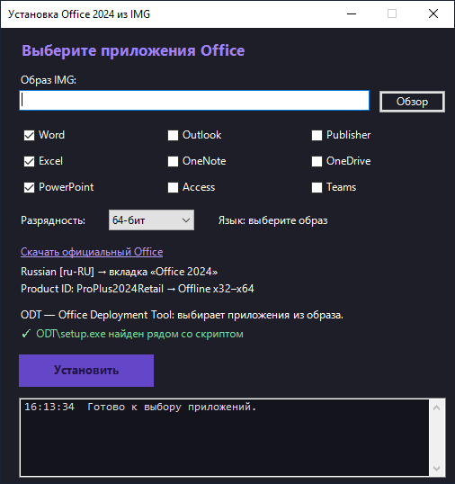
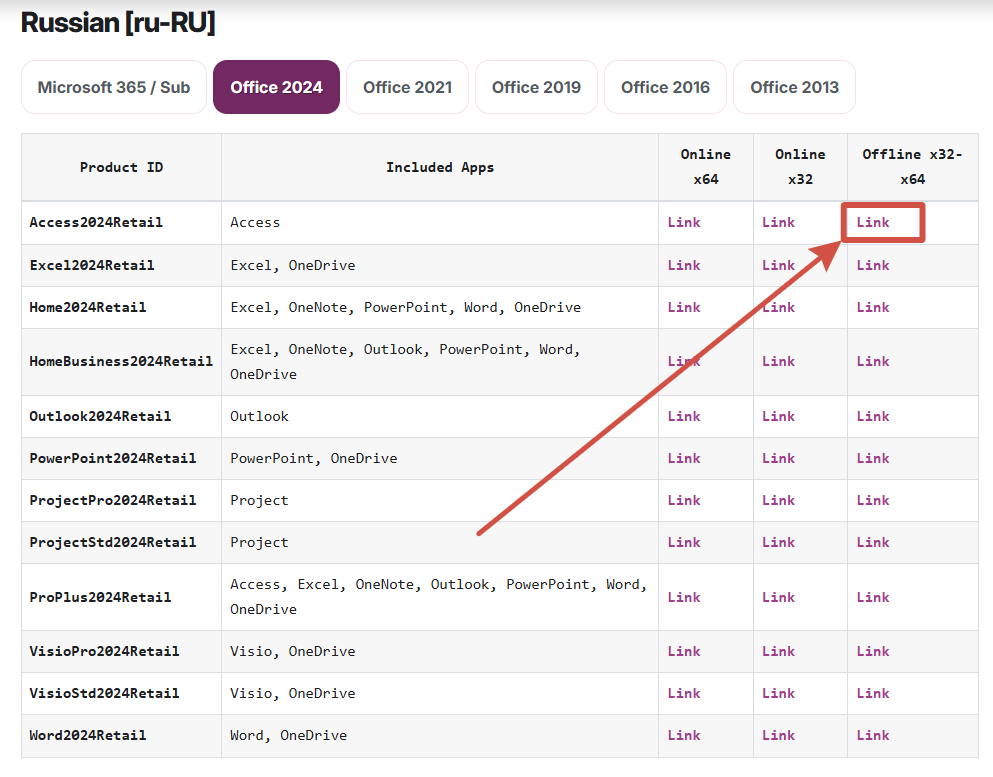
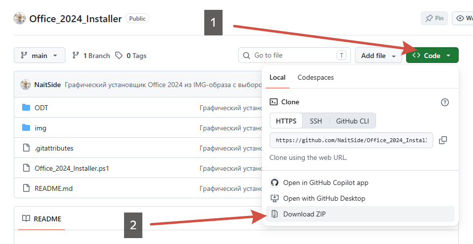

# Office 2024 Installer

Графический установщик Office 2024 из IMG-образа с возможностью выбрать нужные приложения. Обычный установщик образа ставит пакет целиком, без такого выбора.

## Как использовать

1. Скачайте образ на [странице загрузки Office](https://massgrave.dev/office_c2r_links#russian-ru-ru).

   **Russian [ru-RU] → вкладка «Office 2024» → Product ID: ProPlus2024Retail → Offline x32–x64**

   

2. На странице этого репозитория нажмите **Code → Download ZIP**, чтобы скачать установщик со всеми файлами.

   

3. Распакуйте **весь** ZIP-архив. В распакованной папке нажмите правой кнопкой мыши по файлу `Office_2024_Installer.ps1` и выберите **«Выполнить с помощью PowerShell»**.

Скрипт рассчитан на образ `ProPlus2024Retail` и использует [Office Deployment Tool (ODT)](https://www.microsoft.com/download/details.aspx?id=49117) — служебный установщик Microsoft для выбора приложений Office. Его файл `setup.exe` находится в папке `ODT` рядом со скриптом.

## 🔗 Ссылки

- [GitHub NaitSide](https://github.com/NaitSide)
- [Telegram канал NaitLAB](https://t.me/NaitLAB)
